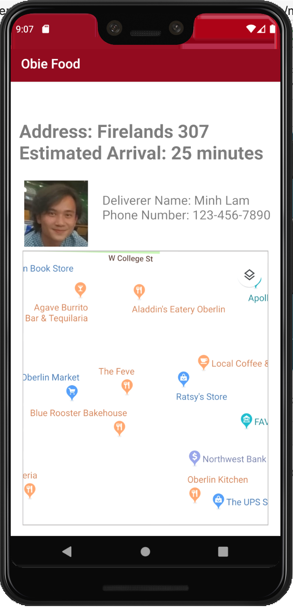

<h1>{{title}}</h1>
<h2>What?</h2>

	Obie Food is our team's pitch for the Startup Weekend Competition. It is an app-based food delivery service at Oberlin. 

	My team had 3 people. My task was to <b>develop</b> the <b>User Interface (UI)</b> for the <b>Mininum Viable Product (MVP)</b> model for an <b>Android App</b> using <b>Android Studio</b>. 

<h2>Why?</h2>

	Our purpose was to come up with a convenient and affordable platform for Oberlin residents to order food without having to pay a 30% mark-up and expensive delivery fee. Hence, the solution is a mobile app run by Oberlin students. Our app also has a delivery tracking system for Obies to order food at ease!

<a href="https://docs.google.com/presentation/d/1Pc-4CIKHmX5g5Eobktcgfr81_YiqVSPi5ur76MsUb5I/edit?fbclid=IwAR2moKQRi4nYs0Ats36Dvg6rFZ3G-om8U9m9WcsJQRtDdF068CMBaHq9Eck#slide=id.p">This slide</a> offers more details about current food delivering situation at Oberlin

<h2>How?</h2>

	I used Android Studio for the first time to build the MVP model. The model has 4 pages representing the 4 primary functions of the app:

<ol>
	<li>Display of Restaurants</li>
	
	<li>Menu and Selections</li>
	
	<li>Payment and Address</li>
	
	<li>Delivery Time Tracking</li>
	
</ol>

<!-- /.blurb -->

<h2>When and Where?</h2>

The Startup Weekend where our pitch happened took place during the last week of September 2019, which was my first semester at Oberlin College.

<h2>What Did I Learn?</h2>
<h3>Skill Set</h3>
<ul>
	<li>Use ConstraintLayout to design complex layouts</li>
	<li>Apply animations to enhance user experience</li>
	<li>Use appropriate menus</li>
	<li>Implement navigation between pages</li>
</ul>
<h3>Soft Skills</h3>

Leadership and teamwork.

